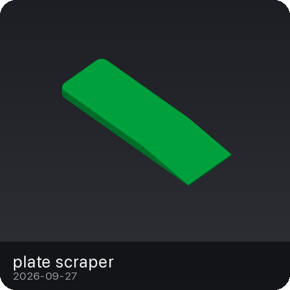
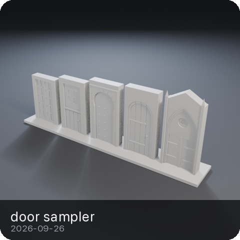

# bambi


## what

Wanting a 3d printer had been a talking point for so long that it was starting to become part of my identity. To fix that, my wife surprised me one day with a p1s. Same energy as the christmas my brothers and I got an n64: pure boyish joy + excitement + chaos.

My old process for making 3d prints was the typical one: build the model (rhino) -> export to stl -> import and set it up in the slicer -> print.

But that was back when I did everything manually and had no programming experience. Now I want to see how much of it can be automated and built agentically.

So, here's what this fucking thing does right now:

- **Slicing without the clicking.** Utility scripts wrap the Bambu Studio CLI so you can slice a model without opening yet another piece of software and clicking yet another button. That's too many fucking clicks, in this economy?!
- **Vibe modeling.** To maximize the vibing, models get built with Blender's python API over an MCP connection. At some point, when the nurbs start calling, the rhino api comes in.
- **Modeling sessions.** Each project gets its own folder named with the date and project name. It holds everything for whatever the fuck got made in that session: the `.blend`, exported STLs, slice settings, notes and the sliced output.

## how

### setup

This is all built on macOS. You'll need blender, bambu studio, [uv](https://docs.astral.sh/uv/) and [just](https://github.com/casey/just):

```sh
brew install --cask blender bambu-studio
brew install uv just

just setup   # uv sync, create .env, flatten Bambu Studio profiles into profiles/
```

`.env` is only needed if you're printing over LAN. Fill in the printer's IP, access code and serial (they're on the P1S screen under Settings > Network and Settings > Device). Don't fucking commit it.

### the agentic spice

Live modeling with claude runs through the [blender-mcp](https://github.com/ahujasid/blender-mcp) add-on. If you run claude code (or whatever shit you use), it should pick up the hacky `/new-session` skill in `.claude/skills/` for planning out and scaffolding a new modeling session.

### recipes

The `justfile` wraps the common commands:

```sh
just                       # list all commands
just new phone-stand       # sessions/2026-09-26-phone-stand/ with an mm-unit model.blend, opened in Blender
just build phone-stand     # export STL, then run checks, then slice to out/*.gcode.3mf
just studio phone-stand    # open in Bambu Studio -> Print plate sends via Bambu Cloud
just status                # printer status (LAN)
just print phone-stand     # LAN: upload and start (asks first)
```

### printing

Two ways to get it to the printer:

- **Cloud:** `just studio <session>` opens the sliced file in Bambu Studio and you hit Print plate. No `.env` needed.
- **LAN:** `just print <session>` talks to the printer directly. Newer firmware needs LAN-only mode + Developer Mode turned on for it to start the print.

## prints

Every slice drops the plate preview in `sessions/<session>/thumb.png`, and `just render <session>` swaps in a studio render. Click a tile to spin its STL in GitHub's 3D viewer; hover for what it's for.

<!-- gallery:start -->
<p align="center">
<a href="sessions/2026-09-27-plate-scraper/exports/Scraper.stl"></a>
<a href="sessions/2026-09-26-door-sampler/exports/DoorSampler.stl"></a>
<a href="sessions/2026-09-26-colossus-tmg/exports/Base.stl"></a>
<a href="sessions/2026-09-26-calib-cube/exports/calib_cube.stl"></a>
</p>
<!-- gallery:end -->
